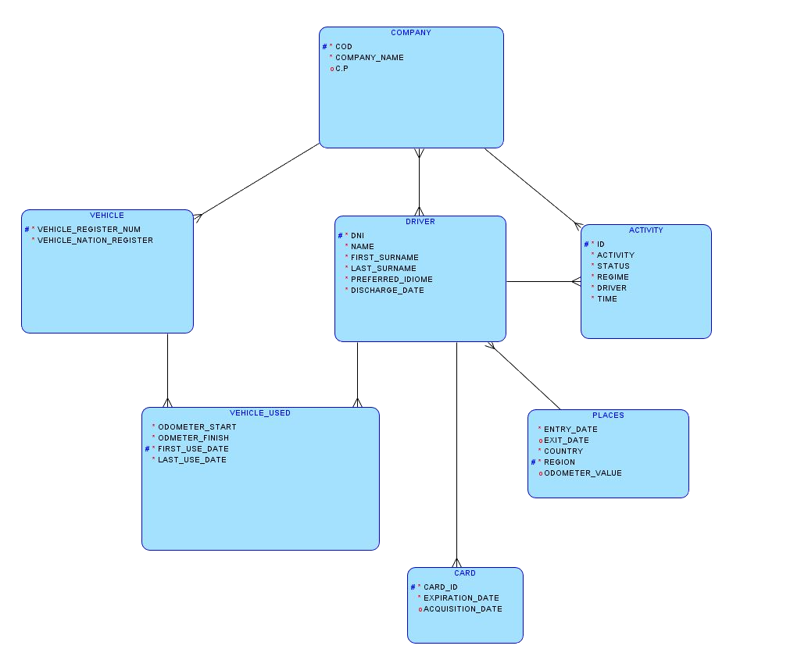

---?color=linear-gradient(to right, #000000, #242523)

@snap[midpoint h2-heading h3-name]
## Proyecto Pre-Feria
### &mdash; Andrés Carmona Lozano &mdash;
@snapend

---?color=linear-gradient(to right, #242523, #9F9F9F)

@snap[west span-40]
@box[idea](Idea principal#La idea principal sobre el proyecto de pre-feria es hacer la estructura de una base de datos de un tacografo digital)
@snapend

@snap[east span-40]
@box[idea](¿Y que es un tacografo digital?# Un tacografo digital es un aparato electrónico que se encarga de registrar eventos en la conducción de vehiculos, su precursor fué el tacografo analógico, el cuál esta previsto que desaparezca completamente por el digital.)
@snapend

---
@snap[north-west span-40 funcionamiento]
@box[idea](Funcionamiento#El tacógrafo digital obtiene datos relativos a los tiempos de conducción y descansos del conductor. Esta información es la más importante de todas y constituye el sentido fundamental del tacógrafo.)
@snapend

@snap[south-east span-60 datos]
@box[idea](Datos#Los eventos recogidos por el tacógrafo incluyen:)
@ul[funcionamiento_lista](false)

    - Conducción, descanso, otros trabajos.
    - Excesos de velocidad.
    - Errores en el sistema.
    - Conducción sin tarjeta.
    - Transferencias de datos: estos datos son almacenados tanto en la memoria del tacógrafo como en la de la tarjeta.
@ulend
@snapend

@snap[south-west]
@css[entidad_relacion](Modelo Entidad-Relacion)
@snapend
@snap[south-west]
@fa[arrow-down prueba]
@snapend

+++

@snap[north entidad span-95]
## Modelo Entidad-Relación
@snapend

@snap[east relacional_1]
@css[relacional](Modelo Relacional)
@snapend
@snap[east relacional_2]
@fa[arrow-right]
@snapend

@snap[west sidebar span-30]
@quote[Descripción del problema: ]
@css[enunciado]([Descripción del problema](https://github.com/Chirili/Proyecto_PreFeria/blob/master/src/statements/problema.md)
@snapend